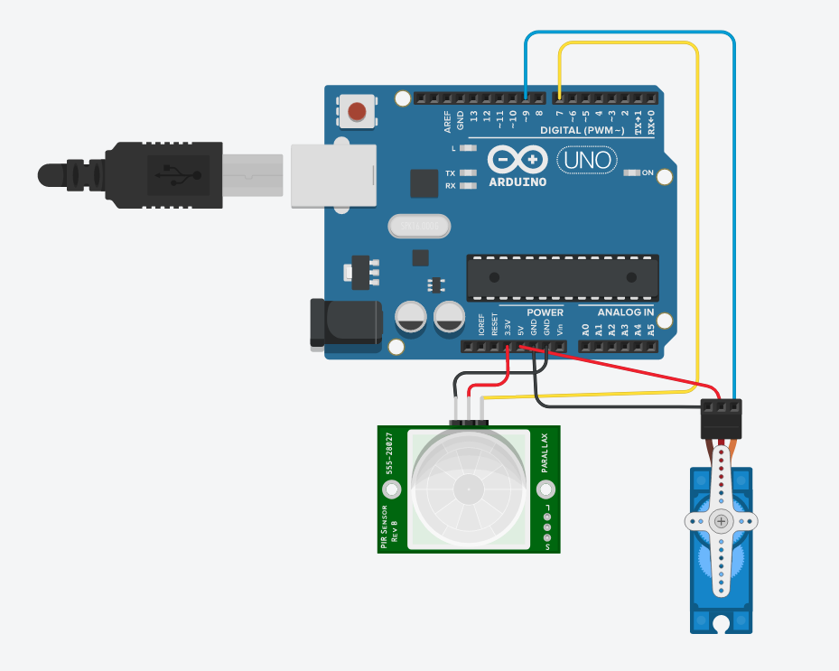

# Pet Feeder

## Sobre

O objetivo principal desse projeto é poder alimentar automaticamente seus pets, e colher métricas de sua alimentação para análise.

Esse projeto foi criado para as aulas de IOT na fiap, em cada tag se encontra versionada uma aula, confira o CHANGELOG. para mais informações.

As tags `v1.x.x` são das aulas do primeiro semestre e as `v2.x.x` são do segundo semestre.

## Materiais

* `1 Arduino Uno e cabo serial`

* `1 Servo motor SG90`

* `1 PIR sensor`

## Cabeamento

Link com exemplo no [tinkercad](https://www.tinkercad.com/things/8q8TVHKfOPz-pet-feeder).

## Integração

Para a integração do segundo semestre trocaremos o microcontrolador por um esp8266, o que mudará os pinos.
E também usaremos um raspberry para receber dados de algumas maneiras diferentes durante as aulas, porém isso pode ser feito no seu computador caso não tenha um raspberry.
